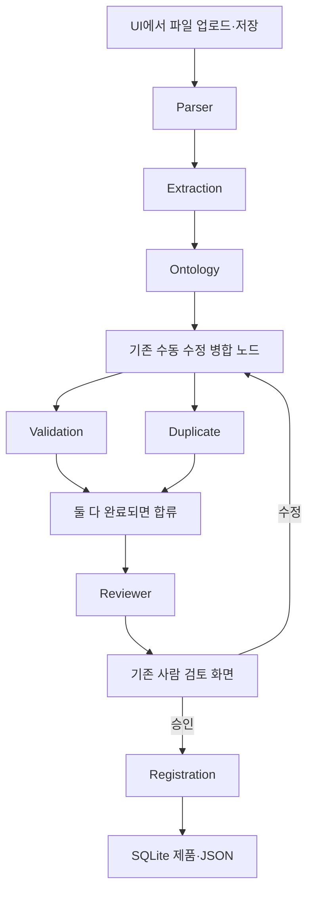

# 팀 협업 가이드: Mock을 실제 기능으로 교체하기

이 문서는 신입 개발자가 담당 기능을 맡아 구현·교체·테스트할 수 있도록 기존 정리 문서를 다시 작성한 것입니다.

**현재 상태 설명과 앞으로 만들 파일을 구분합니다.** 이 문서 작성으로 실제 Parser나 LLM Agent가 구현된 것은 아닙니다. “신규”라고 표시한 파일은 팀원이 앞으로 만들 위치입니다.

저장소 루트는 `D:\ontology-product-system`입니다. 아래 문서의 `src/...`는 이 폴더를 기준으로 읽으세요.

## 처음 읽는 순서

전체 동작을 먼저 이해하려면 [시스템 동작과 온톨로지의 역할](SYSTEM_AND_ONTOLOGY.md)을 읽으세요. 현재 코드에서 실제로 동작하는 규칙과 앞으로 구현할 문서 분석을 구분해 설명합니다.

1. [공통 약속과 용어](team/00_COMMON.md)를 읽습니다. 입력/출력 이름을 바꾸면 다른 팀원 코드가 연결되지 않는 이유를 설명합니다.
2. 아래 표에서 자기 담당 문서를 읽습니다. 각 문서에 현재 Mock, 파일 위치, JSON 예시, 구현 순서, 교체 코드, 테스트, 완료 기준이 있습니다.
3. 기능 하나를 실제 Agent로 바꾸고 나머지는 기존 Mock/실제 구현으로 둔 채 확인합니다.
4. 통합 담당자는 [연결 방법](team/08_INTEGRATION.md)을 따라 UI runtime에 연결합니다.
5. [실제 문서 평가](team/09_EVALUATION.md)로 결과를 확인합니다.

## 분업표

“담당”은 역할 이름입니다. 사람이 적으면 여러 역할을 한 사람이 맡아도 됩니다.

| 담당 | 현재 상태 | 앞으로 맡을 일 | 자세한 설명 |
| --- | --- | --- | --- |
| 문서 처리 | ParserMock | PDF/XLSX/TXT 실제 읽기, 원본 위치 보존 | [01 Parser](team/01_PARSER.md) |
| 정보 추출 | ExtractionMock | 문서에서 LLM으로 제품·속성·근거 추출 | [02 Extraction](team/02_EXTRACTION.md) |
| 분류·정규화 | OntologyMock | 실제 분류, 표준 속성 매핑, 기존 단위 규칙 연결 | [03 Ontology](team/03_ONTOLOGY.md) |
| 검증 | ValidationMock이 실제 규칙 함수 호출 | 실제 Agent로 분리, 검증 경계 사례 테스트 | [04 Validation](team/04_VALIDATION.md) |
| 중복 조회 | UI에서는 실제 SQLite Agent | 기존 기능 검증·개선; 의미 검색은 선택 확장 | [05 Duplicate](team/05_DUPLICATE.md) |
| 검토 판단 | ReviewerMock의 규칙 판단 | 실제 Agent로 분리, 판단·재시도·사람 수정 보호 | [06 Reviewer](team/06_REVIEWER.md) |
| 저장 | UI에서는 실제 SQLite Agent | 승인·멱등 저장·Export 실패 복구 검증 | [07 Registration](team/07_REGISTRATION.md) |
| 통합·LLM 기반 설정 | 기본 registry가 Mock | 공통 LLM client/설정, 실제 registry, runtime/UI 연결 | [08 Integration](team/08_INTEGRATION.md) |
| 평가·QA | 합성 문서 3개 Mock 평가 | 실제 원문/정답, Real 평가와 통합 테스트 | [09 Evaluation](team/09_EVALUATION.md) |

## 팀원끼리 주고받는 데이터

각 Agent가 한 작업을 하고 다음 Agent에게 넘겨주는 결과라고 생각하세요.

| 슬롯 | 반드시 받는 입력 | 있으면 읽을 수 있는 입력 | 반드시 반환할 최상위 키 |
| --- | --- | --- | --- |
| parser | source_documents | 없음 | parsed_documents |
| extraction | parsed_documents | review_result, ontology_mapping, locked_fields | extracted_product |
| ontology | extracted_product | locked_fields, manual_overrides | ontology_mapping, base_normalized_product |
| validation | normalized_product, ontology_mapping | 없음 | validation_result |
| duplicate | normalized_product, ontology_mapping | 없음 | duplicate_candidates |
| reviewer | normalized_product, validation_result, duplicate_candidates, ontology_mapping | review_result, locked_fields | review_result |
| registration | normalized_product, human_review | duplicate_candidates, ontology_mapping | final_product |

이 표는 [현재 계약 파일](../src/ontoproduct/agents/registry.py)의 CONTRACTS와 같습니다. **기본 작업은 키 이름과 자료형을 유지하고, 그 안에 실제 문서에서 얻은 값과 실제 판단 결과를 채우는 것입니다.**

## 실제 처리 흐름

이 그림은 역할 이해용입니다. 실제 오류·재시도·분류 변경 경로 전체는 [compiled graph](workflow.mmd)에 있습니다.

## 협업할 때 파일 소유권

각 기능 담당자는 자신의 `agents/*_agent.py`, 전용 service/prompt, 전용 테스트를 주로 수정합니다. 통합 담당자가 `workflow_runtime.py`, `views/resources.py`, 공통 LLM service/settings, dependency 파일을 모아서 수정합니다.

여러 팀원이 `mocks/agents.py`를 직접 고치면 기존 데모와 테스트가 함께 바뀝니다. 새 Agent를 만들고 Registry에서 교체하세요. Graph, ProductState, 계약은 기본적으로 재사용합니다. 추가 출력 필드가 필요하면 schema 담당자와 먼저 합의하고, 스키마·모든 소비자·테스트를 함께 변경합니다.

## 팀원에게 받을 완료 보고

각 담당자는 PR에 다음 내용을 적으면 됩니다.

- 만든/수정한 파일과 구현 기능.
- 실제 입력 1개와 출력 1개.
- 지원 범위: 예를 들어 텍스트 PDF 지원, 스캔 PDF는 OCR 미지원.
- Mock 대신 자신의 Agent를 등록하는 코드.
- 실행한 테스트와 결과.
- 아직 처리하지 못하는 입력·오류.

현재 기존 전체 테스트는 166개입니다. 새 기능을 완료했다고 말하려면 자기 단위 테스트, 계약 검사, 전체 회귀 테스트, 실제 문서 통합 확인까지 끝내야 합니다.
