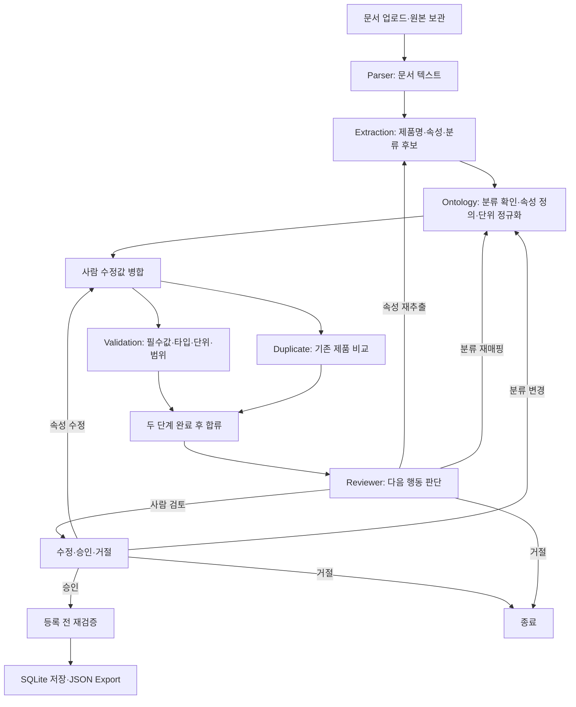

# 시스템 동작과 온톨로지의 역할

이 시스템의 목표는 제조 제품 문서에서 정보를 얻고, 제품 분류에 맞는 공통 속성·단위로 정리한 뒤, 검증과 사람의 승인을 거쳐 제품 DB에 등록하는 것입니다.

온톨로지는 이 과정에서 **“이 제품은 어떤 종류이고, 어떤 속성이 필요하며, 어떤 단위와 값으로 저장해야 하는가”를 정의하는 공통 기준**입니다. 업무 속성 기준은 [ontology.yaml](../src/ontoproduct/ontology/ontology.yaml)에 있으며, 기본 OntologyService는 [product_model.yaml](../src/ontoproduct/ontology/product_model.yaml)의 의미 모델 투영과 일치하는지 검사합니다. 자체 제품 모델·RDF/OWL·SHACL 정의와 확장 방법은 [제품 온톨로지 매뉴얼](team/03_PRODUCT_ONTOLOGY.md)에 있습니다.

기본 Mock 모드는 고정 예제를 사용하며, Real 모드는 실제 Parser·Extraction·Ontology를 사용합니다. 온톨로지 정의 읽기, 상속 속성 계산, 단위 변환, 규칙 검증, 수동 수정, UI의 SQLite 중복 조회·저장은 두 모드에서 실제 코드로 동작합니다. Validation·Reviewer는 기존 Mock의 규칙 판단을 사용합니다. 실행은 [Quick start](QUICK_START.md), 설정과 연결은 [통합 가이드](team/08_INTEGRATION.md)를 참고하세요.

**1. 온톨로지에는 무엇이 들어 있나요?**

현재 제품 분류의 관계는 다음과 같습니다.

```text
Product
├─ ElectricalPart
│  └─ Motor
│     └─ BLDCMotor
└─ MechanicalPart
   └─ Bearing
```

BLDCMotor는 Motor의 하위 분류입니다. Motor에 정의한 manufacturer는 BLDCMotor에도 필수 항목으로 적용됩니다. [OntologyService._resolve](../src/ontoproduct/services/ontology_service.py)는 상위 클래스부터 현재 클래스까지 순서대로 정의를 합칩니다. 하위 클래스가 같은 속성을 다시 정의하면 하위 정의가 적용됩니다.

BLDCMotor에 최종 적용되는 정의는 다음과 같습니다.

| 속성 키 | 의미 | 필수 여부 | 자료형 | 표준 저장 단위 | 허용 입력 단위 | 최솟값 |
| --- | --- | --- | --- | --- | --- | --- |
| manufacturer | 제조사 | 필수, Motor에서 상속 | string | 없음 | 없음 | 없음 |
| rated_voltage | 정격 전압 | 필수 | number | V | V | 0.0 |
| rated_power | 정격 출력 | 필수 | number | W | W, kW | 0.0 |
| rated_speed | 정격 속도 | 필수 | number | rpm | rpm | 0.0 |
| weight | 중량 | 선택 | number | kg | g, kg | 0.0 |

number는 숫자여야 한다는 뜻입니다. 예를 들어 전압은 `value: 24, unit: "V"`로 표현합니다. `value: "24 V"`는 이 정의의 숫자 타입에 맞지 않습니다. minimum=0.0은 음수를 금지하며, 0은 허용합니다. 현재 이 속성들에는 maximum이 정의되어 있지 않습니다.

Pydantic schema와 온톨로지는 역할이 다릅니다. [product schema](../src/ontoproduct/schemas/product.py)는 제품·속성 dictionary의 공통 구조를 검사합니다. 온톨로지는 그 구조 안에서 BLDCMotor에 필요한 항목과 속성별 규칙을 정합니다. [ontology schema](../src/ontoproduct/schemas/ontology.py)는 YAML 정의 자체의 자료형, 알 수 없는 부모 분류, 상속 순환, 잘못된 단위·범위 정의를 검사합니다.

**2. 시스템 전체는 어떤 순서로 움직이나요?**

[workflow.py](../src/ontoproduct/graph/workflow.py)가 아래 실행 순서를 구성합니다. UI의 [WorkflowRuntime](../src/ontoproduct/services/workflow_runtime.py)은 작업별 Graph, 제품 DB, 업로드 파일, SQLite checkpoint를 연결합니다.



그림은 업무 흐름입니다. 실행 중 예외가 발생하면 별도의 오류 처리 노드에서 RETRY 또는 STOP을 받습니다. Reviewer의 자동 추가 시도에는 상한이 있으며, 기본값은 추출·분류 각각 추가 1회입니다. 상한에 도달하면 사람이 수정하도록 이동합니다.

Agent는 각 단계의 입구이고, Service는 실제 작업 함수입니다. 모든 Agent가 LLM을 호출해야 하는 것은 아닙니다. 현재 검증·단위 변환·SQLite 조회·저장은 Python 규칙과 DB 코드로 수행합니다. [execute_agent](../src/ontoproduct/graph/execution.py)는 허용된 입력과 출력 구조를 검사하고 실행 시간·오류를 기록합니다.

**3. 각 단계에서 온톨로지는 어떻게 쓰이나요?**

| 단계 | 받는 자료 → 넘기는 자료 | 온톨로지의 역할 | 현재 UI 동작 |
| --- | --- | --- | --- |
| 업로드 | 파일 bytes → source_documents | 다음 단계가 읽을 파일을 준비 | 원본 파일 실제 보관 |
| Parser | source_documents → parsed_documents | 제품 규칙 적용 전 문서 텍스트 준비 | Mock: 고정 예제 / Real: PDF·XLSX·TXT 실제 파싱 |
| Extraction | parsed_documents → extracted_product | 표준 속성과 연결할 원문 정보·분류 후보 준비 | Mock: DM-500 / Real: LLM으로 원문 속성·근거 추출 |
| Ontology | extracted_product → ontology_mapping, base_normalized_product | 분류 존재 확인, 상속 속성 계산, 지원 단위 변환 | Mock: 고정 분류 판단 / Real: 실제 분류·매핑; 공통 OntologyService로 정규화 |
| 수동 수정 병합 | 기본 제품 + 사람 수정 → normalized_product | 현재 분류의 속성에 수정 적용, 수정 단위 정규화 | 실제 규칙 처리 |
| Validation | normalized_product + ontology_mapping → validation_result | 필수값·타입·표준 단위·범위·분류 일치 검사 | ValidationMock이 실제 validate_product 호출 |
| Duplicate | 정규화 제품 → duplicate_candidates | 표준화된 분류·값·단위가 비교 기준 | 실제 SQLite 규칙 비교 |
| Reviewer | 제품 + 검증 + 후보 + 매핑 → review_result | 필수 속성과 신뢰도를 보고 재추출·재매핑·수정·승인 대기 판단 | ReviewerMock의 규칙 처리 |
| Registration | 제품 + 사람 승인 → final_product | OntologyService의 속성 정의로 최종 검증 | 실제 SQLite 저장·JSON Export |

Duplicate는 ontology_mapping을 입력 계약으로 받지만, 현재 [DuplicateService](../src/ontoproduct/services/duplicate_service.py)는 그 정의를 직접 조회하지 않습니다. 앞에서 정규화된 제품의 product_class와 속성 값·단위, 제품명을 비교합니다. 온톨로지가 비교 가능한 자료를 만드는 방식으로 간접 적용됩니다. 중복 후보만으로 등록이 자동 차단되지는 않습니다.

**4. 제품 정보는 실제로 어떻게 바뀌나요?**

Real 모드에서 처리할 문서의 설명용 예시입니다. 실제 모델의 추출 결과는 근거와 함께 확인해야 합니다.

```text
제품명: DM-600
제품 종류: BLDC 모터
제조사: XYZ Motors
정격 전압: 24 V
정격 출력: 0.6 kW
정격 속도: 3200 rpm
```

Real ExtractionAgent는 이 원문에서 product_name, candidate_class, attributes와 근거를 추출합니다. Ontology 단계는 선택한 BLDCMotor 분류가 정의에 존재하는지 확인하고 필수·선택 속성을 계산합니다. 실제 Extraction·Ontology Agent가 원문 항목을 manufacturer, rated_voltage, rated_power, rated_speed 같은 표준 키와 제품 분류에 연결합니다.

온톨로지상 rated_power의 표준 단위는 W입니다. 따라서 기존 [normalize_unit](../src/ontoproduct/services/ontology_service.py)으로 `0.6 kW → 600.0 W`를 처리할 수 있습니다. [normalize_attributes](../src/ontoproduct/services/normalization_service.py)가 제품 속성별로 이 변환을 호출합니다. 지원하지 않는 단위는 원래 값을 보존하여 후속 검증에서 오류를 표시합니다.

Ontology 단계가 만드는 결과는 두 가지입니다.

- **ontology_mapping:** 이번 제품의 분류와 분류 신뢰도, 상속까지 반영한 필수·선택 속성 정의입니다. YAML 전체와는 구분되는 작업별 매핑 결과입니다.
- **base_normalized_product:** 표준 단위로 정리한 기본 제품입니다. 사람이 수정하기 전 기준값입니다.

이후 Graph가 사람 수정값을 병합해 **normalized_product**를 만들고, Validation·Duplicate·Reviewer가 이 제품을 사용합니다. 등록 후에는 DB에 저장한 제품을 **final_product**로 반환합니다.

위 예시에는 필수값이 모두 있으므로 검증을 통과합니다. weight가 없어도 선택 항목이므로 경고만 발생합니다. 반면 rated_speed가 없으면 MISSING_REQUIRED 오류가 발생하며 valid=false입니다. 검증 함수의 현재 메시지는 영어 고정 문자열입니다.

Mock 모드에 이 문서를 업로드하면 DM-500 예제를 반환합니다. Real 모드는 실제 문서를 읽고 모델로 추출하므로 결과와 근거를 직접 검토합니다.

**5. 사람이 수정하거나 분류를 바꾸면 어떻게 되나요?**

사람이 속도를 입력하면 [human_edits](../src/ontoproduct/services/normalization_service.py)는 수정값의 provenance를 HUMAN으로, confidence를 null로 기록하고 수정 경로를 locked_fields에 넣습니다. 이후 [apply_overrides](../src/ontoproduct/services/normalization_service.py)가 현재 분류의 규칙으로 정규화·병합합니다. Graph는 검증과 중복 비교, Reviewer를 다시 실행합니다.

예를 들어 사람이 BLDCMotor를 Bearing으로 바꾸면 [human_review](../src/ontoproduct/graph/nodes.py)가 Ontology 단계로 돌아갑니다. 새 분류는 inner_diameter와 outer_diameter가 필수입니다. 기존 모터 속성의 수동 수정값 중 새 분류에서 사용할 수 없는 값은 orphaned_overrides에 보관하고, 분류를 되돌리면 다시 적용할 수 있습니다.

현재 병합 규칙은 분류에서 정의되지 않은 **기본 제품의 속성까지 전부 삭제하지는 않습니다.** 남은 속성은 Validation이 UNKNOWN_PROPERTY 경고로 표시합니다. 분류 변경 시 새 필수값을 채우고 재검증해야 합니다.

**6. 승인과 저장에도 온톨로지가 쓰이나요?**

사람의 승인은 “등록을 진행해도 된다”는 명시적인 요청입니다. Graph는 승인 시 validation.valid, Reviewer의 can_register, 미해결 실행 오류를 확인합니다. 승인 전에는 이 작업의 제품을 저장하지 않습니다.

[RegistrationService.register](../src/ontoproduct/services/registration_service.py)는 승인 여부와 제품 구조를 검사한 뒤 **OntologyService에서 해당 분류의 속성 정의를 다시 읽어 제품을 검증합니다.** 앞 단계의 매핑 결과가 잘못되었더라도 현재 YAML 기준으로 검증 실패하면 저장하지 않습니다.

이 정의는 OntologyService를 생성할 때 YAML에서 읽어 메모리에 보관합니다. 등록 때 YAML 파일을 매번 새로 읽는 것은 아닙니다. YAML을 수정했다면 개발 서버를 재시작하거나 Runtime을 새로 생성해 바뀐 정의를 적용해야 합니다.

통과한 제품은 SQLite 제품 DB에 product_class와 attributes를 포함하여 저장하고 JSON으로 Export합니다. 같은 case_id의 반복 등록은 기존 제품을 재사용합니다. DB 저장 후 Export가 실패하면 오류 재시도로 기존 제품의 JSON을 복구합니다.

중간 상태는 제품 DB와 별도의 SQLite checkpoint에 저장합니다. 따라서 사람 수정·승인 대기와 오류 처리 중에 서버를 재시작해도 작업을 이어갈 수 있습니다.

**7. Mock 모드 실행 확인 기록**

기본 WorkflowRuntime과 별도 임시 데이터 폴더로 확인했습니다. 업로드한 TXT에는 다른 제품명과 0.6 kW, 3200 rpm을 넣었지만, 실제 결과는 현재 Mock 정의를 따랐습니다.

| 시점 | 결과 |
| --- | --- |
| 업로드 후 실행 | DM-500 / BLDCMotor, 0.5 kW가 500.0 W로 변환 |
| 필수 항목 검사 | manufacturer는 Motor에서 상속; rated_speed 누락 오류, weight 누락 경고 |
| 자동 재추출 추가 1회 후 | 속도 누락 유지, NEEDS_FIX, 이 작업의 저장 제품 0개 |
| 사람이 3000 rpm 입력 후 | provenance=HUMAN, confidence=null, valid=true, READY_FOR_HUMAN, 저장 제품 0개 |
| 사람이 승인 후 | REGISTERED, 저장 제품 1개, JSON Export 생성 |

이 실행은 온톨로지 규칙부터 검증·사람 수정·승인·DB 저장까지의 연결을 확인한 것입니다. 실제 원문 분석이나 LLM 추출 품질을 검증한 것은 아닙니다.

**8. Real 모드와 남은 구현 범위**

Real 모드에서는 Parser가 원문을 읽고 Extraction이 실제 속성·근거를 추출하며 OntologyAgent가 실제 분류·표준 속성 매핑을 수행합니다. 현재 UI runtime의 Registry에 연결되어 있습니다. 온톨로지 정의·상속·정규화·검증·사람 수정·승인·저장 흐름은 공통 구현을 재사용합니다.

이때 온톨로지는 여러 제조사의 서로 다른 표기를 공통 분류·속성·단위로 정리하는 기준이 됩니다. 제품 데이터가 같은 규칙을 따르므로 검색·비교·검증에 재사용할 수 있습니다. 분류 판단의 근거와 신뢰도를 만드는 일은 실제 분류·추출 기능의 책임입니다. 온톨로지 규칙을 통과했다는 사실만으로 원문 추출값이 정확하다는 뜻은 아니므로 근거 확인과 실제 문서 평가가 함께 필요합니다.

SHACL 검사는 온톨로지 탐색에서 실행할 수 있지만 Graph의 Validation에 자동 연결되어 있지 않습니다. Validation·Reviewer Agent 교체와 SHACL 업무 정책 통합, RDF DB 저장은 추가 구현 범위입니다.

구현 분담과 교체·테스트 방법은 [팀 협업 가이드](MOCK_REPLACEMENT_PLAN.md)를 참고하세요.
