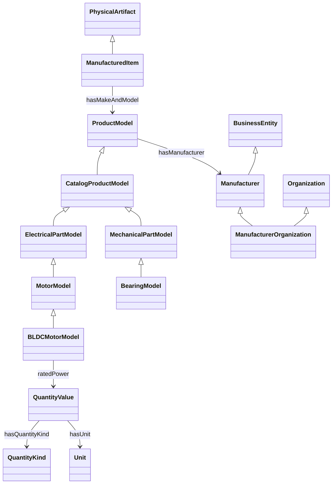

# 03 제품 온톨로지 모델과 실행 방법

## 구축 범위

프로젝트가 직접 정의하고 관리하는 자체 제품 온톨로지다. 제품 모델, 물리 제조물, 제조사 개체를 구분하고 제품군별 속성 의미·관계·수치·단위·등록 제약을 정의한다. 범위는 현재 업무 제품군 Motor·BLDCMotor·Bearing이며 산업 전체를 모델링한 결과는 아니다.

**내재화(2026-10-07, 모델 버전 3.0.0).** 이전 버전은 IOF·GoodRelations·QUDT의 외부 URI를 상위 개념·관계·물리량·단위로 직접 연결했다. 지금은 필요한 개념만 `urn:ontoproduct:ontology:`(아래 `op:`) 아래 자체 정의로 가져왔고, 운영 온톨로지·제품 RDF·SHACL·Agent context에는 외부 업무 URI가 없다. 외부 자료는 설계 참고이며, 대응 관계는 [외부 개념 대응표](03_EXTERNAL_CONCORDANCE.md), 라이선스는 [제3자 고지](../THIRD_PARTY_NOTICES.md)에 있다. 외부 표준 vocabulary 중 유지한 것은 RDF, RDFS, OWL, XSD, SHACL, Dublin Core Terms(`dcterms:`)뿐이다.

## 정의 파일과 단일 원본

| 파일 | 단일 원본으로 관리하는 내용 |
| --- | --- |
| [product_model.yaml](../../src/ontoproduct/ontology/product_model.yaml) | 출처 기록(`sources`), 측정 구조(`measurement`), 개체 클래스·상위 개념(`entity_classes`), 관계, 제품군 프로필, 속성, 분류 규칙, 교차 속성 제약 |
| [unit_mappings.yaml](../../src/ontoproduct/ontology/unit_mappings.yaml) | 단위(기호·이름·물리량·표준 단위 배율), 속성별 물리량, 물리량 종류(이름·설명·SI 차원) |
| [ontology.yaml](../../src/ontoproduct/ontology/ontology.yaml) | 기존 JSON 계약용 호환 투영. product_model.yaml과 다르면 로드 오류 |
| [property_aliases.yaml](../../src/ontoproduct/ontology/property_aliases.yaml) | 속성 동의어 |
| `ontology/rdf/*.ttl` | 위 정의에서 **생성한** 결과물. 직접 고치지 않는다 |

기본 OntologyService는 product_model.yaml로 업무 정의를 만들고 ontology.yaml과 비교한다. 업무 정규화와 RDF 변환은 같은 UnitService를 쓴다. 임의로 주입한 별도 ontology는 기존 방식으로 작동하며, RDF를 쓰려면 그 정의와 일치하는 의미 모델도 주입해야 한다.

로드할 때 다음을 검사한다: 알 수 없는 상위 클래스·순환 상속(다중 상속 포함), 알 수 없는 출처 식별자, 중복되거나 안전하지 않은 이름, 관계의 domain/range, 속성의 물리량·단위 일치, 사용 중인 단위·물리량의 이름·설명 누락, 그리고 정의 데이터 안의 외부 URL(`://`).

## 내부 URI 규칙

| 대상 | 형식 | 예 |
| --- | --- | --- |
| 클래스·관계·속성 | `op:<LocalName>` | `op:ProductModel`, `op:ratedPower` |
| 물리량 종류 | `op:quantitykind/<key>` | `opqk:power` |
| 단위 | `op:unit/<기호>` | `opunit:kW` |
| 출처 | `op:source/<출처>-<버전>` | `opsrc:qudt-3.5.2` |

Turtle의 `opqk:`, `opunit:`, `opsrc:`는 모두 `urn:ontoproduct:ontology:` 아래 하위 namespace다.

## 개념과 관계



- **제품 모델(`op:ProductModel`):** 카탈로그 사양. 앱의 Product/Motor 등 분류는 이 모델 계층에 대응한다. 개별 물리 제품이 아니다.
- **물리 제품(`op:ManufacturedItem` ⊑ `op:PhysicalArtifact`):** 명시적으로 식별된 개별 제품. 제품군별 모델 계층과 나란히 MotorItem 등으로 구성한다. 모델과 물리 제품은 disjoint다. 카탈로그 사양만으로 제품 개체의 존재·재고·제조 공정을 추론하지 않는다.
- **제조사(`op:Manufacturer` ⊑ `op:BusinessEntity`):** 문자열 값을 별도 개체로 투영하고 `op:hasManufacturer` 관계를 만든다. 이름은 label이며 법적 정식 명칭이나 전역 식별자가 아니다. 개체 URI는 레코드 안에서만 식별된다. 같은 이름이라고 `owl:sameAs`를 선언하거나 다른 레코드의 제조사를 합치지 않는다.
- **제조 조직(`op:ManufacturerOrganization` ⊑ Manufacturer, Organization):** 조직임이 별도로 확인될 때만 적용한다. 이름만으로 조직이라고 분류하지 않는다.
- **명시적 상위 타입:** 제품 RDF는 추론 없이도 질의할 수 있도록 상위 개체 타입을 함께 기록한다. 예: 제조사 노드는 `op:Manufacturer`와 `op:BusinessEntity`를 모두 가진다.
- **출처:** 각 개념은 `dcterms:source`로 로컬 출처 식별자를 가리킨다. 출처 노드(`op:SourceRecord`)는 제목·버전·SPDX 라이선스 이름·귀속을 문자열로 가진다. URL은 문서에서만 관리한다.

## 속성·물리량·업무 제약

| 업무 필드 | 의미 | 물리량 종류 | 표준 단위 | 현재 등록 정책 |
| --- | --- | --- | --- | --- |
| manufacturer | 모델을 생산하는 제조사의 이름 | 제조사 개체 관계 | 없음 | Motor 및 하위 모델 필수 |
| rated_voltage | 문서에 명시된 정격 전압 | electric_potential | V | BLDCMotor 필수, 0 이상 |
| rated_power | 문서에 명시된 정격 출력/전력 | power | W | BLDCMotor 필수, 0 이상; kW 허용 |
| rated_speed | 축의 시간당 회전수 | rotational_frequency | rpm | BLDCMotor 필수, 0 이상 |
| weight | 기존 필드 이름이지만 의미는 질량 | mass | kg | BLDCMotor 선택, 0 이상; g 허용 |
| inner_diameter | 베어링 내경 | length | mm | Bearing 필수, 0 이상 |
| outer_diameter | 베어링 외경 | length | mm | Bearing 필수, 0 이상; 내경보다 큼 |

`rated_power`를 입력 전력 또는 축 출력 중 하나로 임의 확정하지 않는다. weight를 힘(N)으로 해석하지 않는다. rpm은 회전 빈도이며 rad/s 값으로 바꾸지 않는다. 물리량의 SI 차원과 단위 배율은 unit_mappings.yaml에서 관리하고 RDF에도 기록한다. 변환은 UnitService가 수행하며 RDF의 배율은 설명용이다.

수치 필드는 RDF의 `op:QuantityValue` 노드로 만든다. 0.6 kW는 아래처럼 변환되며 원문 값·근거는 별도 evidence 노드에 남는다.

```turtle
@prefix op: <urn:ontoproduct:ontology:> .
@prefix opqk: <urn:ontoproduct:ontology:quantitykind/> .
@prefix opunit: <urn:ontoproduct:ontology:unit/> .
@prefix rdfs: <http://www.w3.org/2000/01/rdf-schema#> .

<urn:ontoproduct:record:motor> op:ratedPower <urn:ontoproduct:record:motor:value:rated_power> .

<urn:ontoproduct:record:motor:value:rated_power> a op:QuantityValue ;
    op:numericValue 600.0 ;
    op:hasUnit opunit:W ;
    op:hasQuantityKind opqk:power .

opunit:kW a op:Unit ;
    rdfs:label "kilowatt" ;
    op:symbol "kW" ;
    op:measuresQuantityKind opqk:power ;
    op:conversionTargetUnit opunit:W ;
    op:conversionMultiplier 1000.0 .
```

목록에 없는 단위(예: hp)는 IRI를 추측하지 않고 문자열 그대로 기록한다. SHACL이 표준 단위 위반으로 보고한다.

OWL은 계층·domain/range·값 타입·모델과 물리 제품 구분을 표현한다. 필수 속성과 cardinality는 **폐쇄된 등록 데이터의 SHACL 제약**이다. 사양서에 정격 전압이 빠졌다고 현실의 모터에 전압이라는 성질이 없다는 뜻은 아니다.

## 확장 방법

### 데이터만 고치면 되는 경우

| 확장 | 수정할 곳 |
| --- | --- |
| 새 제품군(예: StepperMotor) | product_model.yaml `classes`에 프로필(parent, model_class, item_class, required, optional) 추가 → ontology.yaml 투영을 같은 내용으로 갱신 → 필요하면 `classification_rules`에 규칙 추가 |
| 기존 물리량의 새 속성(예: 축 지름) | product_model.yaml `properties`에 kind=quantity, predicate, domain, quantity, definition 추가 → unit_mappings.yaml `property_quantities`에 연결 → 프로필의 required/optional에 추가 |
| 기존 물리량의 새 단위(예: mW) | unit_mappings.yaml `units`에 quantity·canonical·multiplier·label·sources 추가 → 속성 definition의 `units`에 허용 단위로 추가 |
| 새 물리량 종류(예: 토크) | unit_mappings.yaml `quantity_definitions`에 label·description·dimension·sources와 표준 단위 추가 |
| 새 개체 상위 개념 | product_model.yaml `entity_classes`에 label·description·parents·sources 추가 |
| 새 출처 | product_model.yaml `sources`에 `<출처>-<버전>` 키로 제목·버전·라이선스·귀속·사용 범위 추가. URL은 [제3자 고지](../THIRD_PARTY_NOTICES.md)와 [대응표](03_EXTERNAL_CONCORDANCE.md)에만 기록 |

수정 후 `uv run python scripts/build_product_ontology.py`로 TTL을 다시 만들고 테스트를 실행한다.

### 코드 변경이 필요한 경우

- 수치·제조사 이외의 속성 종류(예: 여러 값, 범위값, 범주형 코드 목록). `SemanticProperty.kind`는 `entity`·`quantity` 두 가지이고 RDF 변환도 둘만 처리한다.
- 제조사 이외의 개체 관계 속성(예: 공급사). 현재 entity 속성은 range가 Manufacturer인 관계만 허용한다.
- `less_than` 이외의 교차 속성 비교. 비교 연산자는 SHACL SPARQL 생성 코드에 있다.
- 배율이 아닌 변환(예: 섭씨↔화씨처럼 오프셋이 있는 단위). UnitService는 곱셈 배율만 지원한다.
- 기존 ProductAttribute·NormalizedProduct·Agent 입출력 계약 변경.

## 코드 연결과 결과물

- `ProductOntology`: 의미 모델 검증, 업무 정의 생성, 데이터 기반 분류, LLM에 전달할 의미 context 생성. context에는 내부 개념·관계·측정 구조·물리량·단위·출처(제목·버전·라이선스)만 들어가며 URI가 없다.
- ExtractionAgent·OntologyAgent: 위 context를 전달한다. OntologyAgent 프롬프트는 3.0.0이다. 실제 모델 통신은 기존 주입 Protocol이다.
- `RdfOntologyService`: 모델 RDF 변환, ontology/shapes 생성, SHACL 실행. 업무 schema와 Graph 출력 키를 바꾸지 않는다.
- `OntologyService.to_rdf(product, record_id=...)`, `OntologyService.validate_semantics(product)`: 같은 의미 모델·단위 서비스를 사용한 RDF 변환과 SHACL 결과 `{valid, issues, report}`.

산출물은 [RDF 디렉터리](../../src/ontoproduct/ontology/rdf)에 있다.

- `product_ontology.ttl`: 자체 OWL/RDFS 계층·관계·측정 구조·물리량 종류·단위·출처 기록.
- `product_shapes.ttl`: 상속 필수값, 단일값, 제조사 개체/이름, 수치 타입·유한성·범위, 표준 단위, 물리량 종류, 모델/물리 제품 구분, 베어링 치수 비교.
- `example_motor.ttl`, `example_bearing.ttl`: 원문 근거·PDF/Excel 위치를 포함한 fixture의 RDF 변환.

null과 충돌 값은 숫자값으로 내보내지 않는다. 필수 충돌은 SHACL 누락 오류가 되며 후보값·출처는 별도 evidence 노드와 원래 속성 JSON에 남는다. 클래스 밖 속성도 evidence 기록에서 제거하지 않는다.

## 실행

```powershell
uv sync --locked
uv run python scripts/build_product_ontology.py
uv run pytest tests/test_ontology_internalization.py tests/test_product_semantic_model.py tests/test_rdf_product_ontology.py tests/test_real_document_graph.py -q
```

빌드 스크립트는 로컬 YAML·JSON만 읽는다. 모델 정의와 SHACL을 만들고 모터·베어링 fixture의 준수 여부를 검증한 뒤 사례 TTL을 기록한다. 외부 모델 호출이나 DB 등록은 하지 않는다.

```python
from ontoproduct.services.ontology_service import OntologyService

ontology = OntologyService()
graph = ontology.to_rdf(normalized_product, record_id="catalog-001")
result = ontology.validate_semantics(normalized_product)
# 별도로 식별한 실제 제품과 조직이라는 사실이 있을 때만 지정한다.
graph = ontology.to_rdf(normalized_product, record_id="catalog-001",
                        item_id="serial-001", manufacturer_is_organization=True)
```

## 기존 데이터 이관

앱 데이터(`runtime/`)에는 RDF가 저장되어 있지 않다. 제품은 JSON으로 저장되고 RDF는 필요할 때 생성되므로 사용자 데이터 이관은 필요 없다. 저장소의 TTL 4개는 생성 스크립트로 다시 만들었다. 외부에서 이전 버전 RDF를 받아 둔 경우, 위 대응표로 외부 IRI를 내부 IRI로 바꿀 수 있지만 단위·물리량 노드 구조가 바뀌었으므로 원본 제품 JSON에서 다시 생성하는 것을 권장한다.

## 그래프로 보기

```powershell
uv run streamlit run app.py
```

앱의 **온톨로지 탐색** 메뉴(`/ontology`)에서 기존 클래스 상속·속성 표 아래의 **개념 관계와 제품 데이터**를 확인한다.

- **온톨로지 관계:** 선택 제품군 또는 전체 구조의 모델/물리 제품 계층, 제조사 관계, 자체 정의한 물리량·단위를 표시한다. 개념과 업무 관계는 `urn:ontoproduct:ontology:` 아래 내부 URI를 사용하며, 선의 이름은 실제 RDF 관계다.
- **제품 데이터 그래프:** DM-600 모터와 BR-6201 베어링 샘플, 또는 SQLite에 저장된 제품을 선택한다. 제품→제조사, 제품→물리량 값→숫자·단위·물리량 종류의 관계를 표시한다.
- **근거 표시:** 파일·페이지·원문 근거 체크박스로 출처 노드까지 펼친다. 표에는 입력 속성 값과 RDF에서 표준 단위로 변환한 값을 함께 표시한다. 샘플은 `0.6 kW → 600 W`, `750 g → 0.75 kg`와 PDF/Excel 위치를 포함한다. 저장 제품의 입력 값은 저장된 속성 값이며 파싱 전 숫자를 별도로 복원하지 않는다.
- **데이터 확인:** 그래프 데이터와 원본 RDF를 펼치면 전체 triple 표, 표시된 노드·관계 JSON, Turtle 원문을 볼 수 있다. RDF/JSON 다운로드와 그래프 도구 모음의 PNG 다운로드·전체 화면을 사용할 수 있다.
- **사양 제약 검사:** 선택한 제품 그래프에 실제 SHACL 검증을 실행한다. DB 등록·수정과 LLM 호출은 하지 않는다.

화면의 관계 그래프는 RDF에서 주요 계층·관계·수치 구조를 선택해 보여 준다. OWL restriction 등 모든 triple을 시각적 노드로 펼치지는 않으며, 전체 데이터는 원본 RDF 표와 다운로드에 포함된다. 예제 TTL은 패키지에 포함된 fixture로 운영 모델의 추출 결과가 아니다.

변환 코드는 `services/ontology_visualization.py`, 화면은 `views/ontology_graphs.py`, 검증은 `tests/test_ontology_visualization.py`에 있다.

```powershell
uv run pytest tests/test_ontology_visualization.py tests/test_phase3_ui.py::test_ontology_hierarchy_inherited_fields_and_real_unit_conversion -q
```

## 운영 연결과 검증 한계

기본 OntologyService와 실제 02/03 Agent는 이 모델을 사용한다. RDF/SHACL API는 실행·검증 가능하다. UI Real Registry/runtime의 Parser·Extraction·Ontology 연결은 구현되어 있다([통합 가이드](08_INTEGRATION.md)). RDF DB 저장과 Graph의 Validation 노드에서 SHACL 결과를 업무 정책과 합치는 작업은 아직 하지 않았다. 현재 운영 앱의 기존 Validation은 베어링 내경<외경 제약을 자동 적용하지 않는다.

외부 표준과의 상호운용(다른 QUDT·GoodRelations 기반 데이터와 바로 합치기)은 내재화로 기본 제공되지 않는다. 필요하면 대응표로 별도 정렬 그래프를 만든다. SHACL은 데이터 제약을 확인하며 원문 사실의 진실성이나 모든 물리적 타당성을 보장하지 않는다. 테스트 결과와 남은 통합 작업은 [인계 문서](02_03_IMPLEMENTATION_HANDOFF.md)를 따른다.
