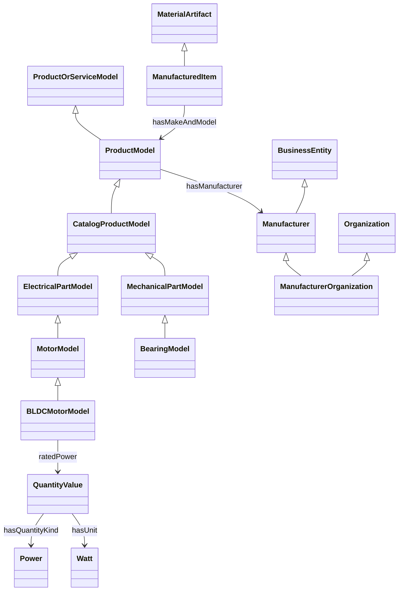

# 03 제품 온톨로지 모델과 실행 방법

## 구축 범위

기존 URI 참고 목록을 확장하여 IOF·GoodRelations·QUDT에 연결되는 자체 제품 온톨로지를 구성했다. 제품 모델, 물리 제조물, 제조사 개체를 구분하고 제품군별 속성 의미·관계·수치·단위·등록 제약을 정의한다. 범위는 현재 업무 제품군 Motor·BLDCMotor·Bearing이며 산업 전체를 모델링한 결과는 아니다.

원본 모델은 [product_model.yaml](../../src/ontoproduct/ontology/product_model.yaml)이다. [ontology.yaml](../../src/ontoproduct/ontology/ontology.yaml)은 기존 JSON 계약용 호환 투영이다. 기본 OntologyService는 원본 모델로 정의를 생성하고 투영 파일과 불일치하면 오류를 낸다. 분류 규칙도 모델 데이터에서 읽는다. 임의로 주입한 별도 ontology는 기존 방식으로 작동하며, RDF를 사용하려면 그 정의와 일치하는 의미 모델도 주입해야 한다.

로컬 namespace는 `urn:ontoproduct:ontology:`다. 외부 기관의 URI를 흉내 내거나 공개된 서비스 URI라고 주장하지 않는다.

## 개념과 관계



- **제품 모델:** GoodRelations ProductOrServiceModel의 자체 하위 클래스로 카탈로그 사양을 표현한다. 앱의 Product/Motor 등의 분류는 이 모델 계층에 대응한다.
- **물리 제품:** IOF MaterialArtifact와 GoodRelations Individual에 연결되는 별도 계층이다. 제품군별 모델 계층과 나란히 ProductItem/MotorItem 등으로 구성한다. 모델과 물리 제품은 disjoint로 선언한다. 수입·재고·제조 공정이나 제품 개체의 존재는 카탈로그 사양만으로 추론하지 않는다.
- **제조사:** 문자열 값을 별도 Manufacturer 개체로 투영하고 `gr:hasManufacturer` 관계를 생성한다. 이름은 개체의 label이며 법적 정식 명칭이나 세계적으로 유일한 기업 식별자로 취급하지 않는다. 개체 URI는 모델 레코드 안에서만 식별된다. 같은 이름이라고 `owl:sameAs`를 선언하거나 다른 레코드의 제조사를 합치지 않는다.
- **제조 조직:** 조직임이 별도로 확인될 때만 ManufacturerOrganization/IOF Organization을 적용한다. 제조사 문자열만으로 조직이라고 분류하지 않는다.
- **외부 연결:** 자체 하위 클래스·하위 관계로 연결한다. 의미가 비슷한 내부 숫자 필드와 외부 관계를 equivalentProperty로 선언하지 않는다. 외부 전체 공리를 import하지 않으며 실행 시 웹을 호출하지 않는다.

## 속성·물리량·업무 제약

| 업무 필드 | 의미 | QUDT 물리량 | 표준 단위 | 현재 등록 정책 |
| --- | --- | --- | --- | --- |
| manufacturer | 모델을 생산하는 제조사의 이름 | 제조사 개체 관계 | 없음 | Motor 및 하위 모델 필수 |
| rated_voltage | 문서에 명시된 정격 전압 | Voltage | V | BLDCMotor 필수, 0 이상 |
| rated_power | 문서에 명시된 정격 출력/전력 | Power | W | BLDCMotor 필수, 0 이상; kW 허용 |
| rated_speed | 축의 시간당 회전수 | RotationalFrequency | rpm | BLDCMotor 필수, 0 이상 |
| weight | 기존 필드 이름이지만 의미는 질량 | Mass | kg | BLDCMotor 선택, 0 이상; g 허용 |
| inner_diameter | 베어링 내경 | Length | mm | Bearing 필수, 0 이상 |
| outer_diameter | 베어링 외경 | Length | mm | Bearing 필수, 0 이상; 내경보다 큼 |

`rated_power`를 입력 전력 또는 기계적 축 출력 중 하나로 임의 확정하지 않는다. 원문에 그런 의미가 명시되기 전에는 일반적인 정격 사양으로 보존한다. weight를 힘(N)으로 해석하지 않는다. rpm은 QUDT가 REV-PER-MIN을 적용 단위로 명시한 RotationalFrequency에 연결하며 rad/s 값으로 바꾸지 않는다. 물리량의 SI 차원은 공유 단위 카탈로그에서 관리한다.

수치 필드는 RDF의 QuantityValue 노드로 만든다. 예를 들어 0.6 kW는 아래 관계로 변환되며 원문 값·근거는 별도 evidence 노드에 유지한다.

```turtle
@prefix op: <urn:ontoproduct:ontology:> .
@prefix qudt: <http://qudt.org/schema/qudt/> .
@prefix unit: <http://qudt.org/vocab/unit/> .
@prefix qk: <http://qudt.org/vocab/quantitykind/> .

<urn:ontoproduct:record:motor> op:ratedPower [
    a qudt:QuantityValue ;
    qudt:numericValue 600.0 ;
    qudt:hasUnit unit:W ;
    qudt:hasQuantityKind qk:Power
] .
```

OWL은 계층·domain/range·값 타입·모델과 물리 제품 구분을 표현한다. 필수 속성과 cardinality는 **폐쇄된 등록 데이터의 SHACL 제약**이다. 사양서에 정격 전압이 빠졌다고 현실의 모터에 전압이라는 물리적 성질이 없다는 뜻은 아니다. 현재 등록 정책을 세계의 보편적 공리로 선언하지 않는다.

## 코드 연결과 결과물

- `ProductOntology`: 의미 모델 검증, 기존 업무 정의 생성, 데이터 기반 분류, LLM에 전달할 의미 context 생성.
- 기본 ExtractionAgent와 OntologyAgent: 클래스 의미·제조사 관계·물리량 context를 전달한다. 실제 모델 통신은 기존 주입 Protocol이다.
- `RdfOntologyService`: 모델 RDF 변환, ontology/shapes 생성, SHACL 실행. 기존 업무 schema와 Graph 출력 키를 바꾸지 않는다.
- `OntologyService.to_rdf(product, record_id=...)`: 같은 의미 모델·단위 서비스를 사용한 RDF 변환.
- `OntologyService.validate_semantics(product)`: 실제 SHACL 결과 `{valid, issues, report}` 반환.

산출물은 [RDF 디렉터리](../../src/ontoproduct/ontology/rdf)에 있다.

- `product_ontology.ttl`: 자체 OWL/RDFS 계층·관계·물리량 의미·출처.
- `product_shapes.ttl`: 상속 필수값, 단일값, 제조사 개체/이름, 수치 타입·유한성·범위, 표준 단위, 물리량 종류, 모델/물리 제품 구분, 베어링 치수 비교.
- `example_motor.ttl`, `example_bearing.ttl`: 실제 원문 근거·PDF/Excel 위치를 포함한 준비된 fixture의 RDF 변환.

null과 CONFLICT는 숫자값으로 내보내지 않는다. 필수 충돌은 SHACL 누락 오류가 되며 후보값·출처는 별도 evidence 노드와 원래 속성 JSON에 보존한다. 클래스 밖 속성도 evidence 기록에서 제거하지 않는다. RDF 검증은 완성된 모델의 검증 API이며, 기존 Graph의 필수 충돌→재추출→사람 수정 흐름은 유지한다.

## 실행

```powershell
uv sync --locked
uv run python scripts/build_product_ontology.py
uv run pytest tests/test_product_semantic_model.py tests/test_rdf_product_ontology.py tests/test_real_document_graph.py -q
```

빌드 스크립트는 로컬 YAML·JSON만 읽는다. 모델 정의와 SHACL을 만들고 모터·베어링 fixture의 준수 여부를 실제 검증한 뒤 사례 TTL을 기록한다. 외부 모델 호출이나 DB 등록은 하지 않는다. script의 `--output`, `--examples`로 경로를 지정할 수 있다.

```python
from ontoproduct.services.ontology_service import OntologyService

ontology = OntologyService()
graph = ontology.to_rdf(normalized_product, record_id="catalog-001")
result = ontology.validate_semantics(normalized_product)
# 별도로 식별한 실제 제품과 조직이라는 사실이 있을 때만 지정한다.
graph = ontology.to_rdf(normalized_product, record_id="catalog-001",
                        item_id="serial-001", manufacturer_is_organization=True)
```

## 운영 연결과 검증 한계

기본 OntologyService의 업무 정의와 실제 02/03 Agent의 의미 context/분류는 새 모델에 연결됐다. RDF/SHACL API는 실행·검증 가능하다. 운영 Registry/runtime 목업 교체, RDF DB 저장, Graph의 Validation 노드에서 SHACL 결과를 업무 정책과 합치는 작업은 아직 수행하지 않았다. 현재 운영 앱의 기존 Validation은 베어링 내경<외경 제약을 자동 적용하지 않는다.

SHACL은 데이터 제약을 확인하며 원문 사실의 진실성이나 모든 물리적 타당성을 보장하지 않는다. RDF를 외부 저장소에 보내거나 외부 전체 온톨로지를 불러오는 작업은 포함하지 않는다. 출처·실제 외부 확인 범위는 [외부 자료 기록](02_03_EXTERNAL_SOURCES.md), 테스트 결과와 통합 담당자 작업은 [인계 문서](02_03_IMPLEMENTATION_HANDOFF.md)를 따른다.
